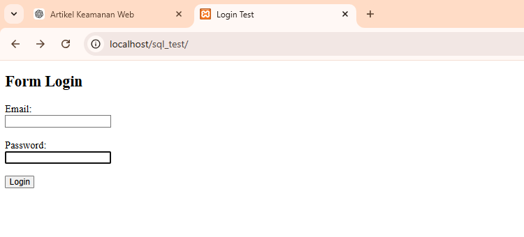

#  Uji Keamanan Form Login: Simulasi SQL Injection

## Deskripsi

Project ini dibuat untuk memahami bagaimana celah keamanan pada form login dapat terjadi, khususnya serangan SQL Injection.

Dalam project ini, saya melakukan percobaan langsung menggunakan PHP dan MySQL di localhost untuk melihat bagaimana sistem bisa ditembus, serta bagaimana cara mengamankannya.

---

## Tools yang Digunakan

- Visual Studio Code
- XAMPP (Apache & MySQL)
- PHP Native
- MySQL

---

##  Setup Database

Jalankan di phpMyAdmin:

```sql
CREATE DATABASE test_db;

USE test_db;

CREATE TABLE users (
    id INT AUTO_INCREMENT PRIMARY KEY,
    email VARCHAR(100),
    password VARCHAR(100)
);

INSERT INTO users (email, password) VALUES
('admin@gmail.com', '12345'),
('user@gmail.com', 'user123');

# Struktur Project

sql_test/
│
├── index.php
├── login.php
└── assets/
    └── images/


## Cara Menjalankan di Visual Studio Code

1. Buka folder project di Visual Studio Code
2. Pastikan XAMPP sudah jalan (Apache & MySQL)
3. Simpan project di folder htdocs
Buka browser:
http://localhost/sql_test 

## Eksperimen SQL Injection
Login Normal
Email: admin@gmail.com
Password: 12345
Hasil: Login berhasil


## SQL Injection (Versi Rentan)

Input password:
' OR '1'='1
Hasil: Login berhasil (celah keamanan ditemukan)


## Perbaikan Sistem
Menggunakan prepared statement:
$stmt = $conn->prepare("SELECT * FROM users WHERE email=? AND password=?");
$stmt->bind_param("ss", $email, $password);
$stmt->execute();

## hasil eksperimen

1. halaman login

